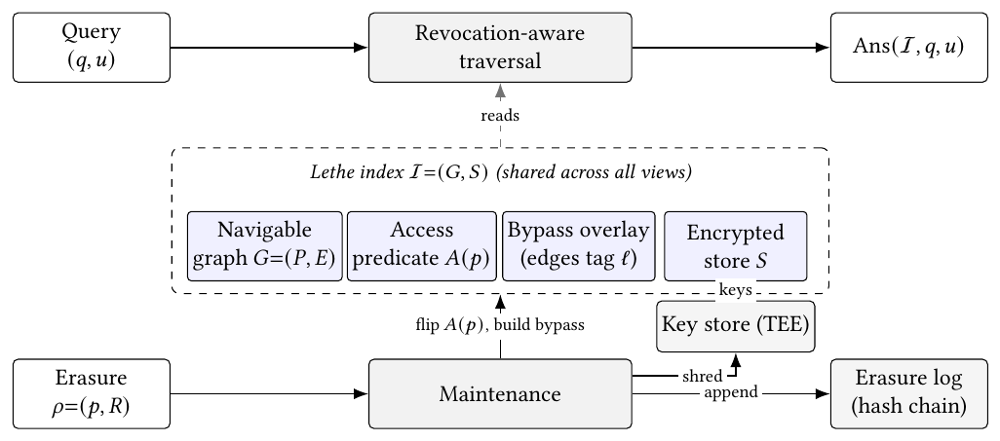

<div align="center">

# 🪦 Laying Zombie Vectors to Rest
### Per-View Erasure in Graph Indexes

*A revoked vector should disappear from a viewer's results **and** stop steering their search, and be provably, physically gone.*

[](https://www.python.org/)
[](LICENSE)
[](tests/)
[](paper/lethe-extended.pdf)
[](https://github.com/anonymous-ai-researcher/vldb2027-id695)
[](#-reproduce-in-three-commands)

**Artifact:** [`https://github.com/anonymous-ai-researcher/vldb2027-id695`](https://github.com/anonymous-ai-researcher/vldb2027-id695)

</div>

---

## 🎯 The one-paragraph version

In a **shared** access-controlled graph vector index (HNSW, DiskANN), revoking a
user's access to a vector is not enough to delete it. The vector physically
persists, and worse, it **keeps steering the revoked user's search**, a *zombie
vector* that routes queries it can never appear in. We call removing this lingering
influence **per-view erasure**: after revocation the index must behave, in both its
**results** and its **routing**, as if the vector had never entered the revoked
user's view. **Lethe** achieves this over a single shared structure through
revocation-aware traversal, an effective-view-shared bypass overlay, an append-only
erasure log, and vector-granular cryptographic shredding, driving per-view leakage
to zero while holding recall at the level of an oracle per-view rebuild, at a
fraction of the memory of per-user indexes.

---

## ⚡ Reproduce in three commands

```bash
pip install -r requirements.txt          # numpy, hnswlib, pytest
python3 scripts/run_all.py               # reproduce headline table numbers from released data
python3 -m pytest tests/                  # verify the core invariants (zero leakage, tamper-evidence, ...)
```

That reproduces the paper's main results table from the released measurement data
and checks the load-bearing invariants. To re-derive the **zombie effect from
scratch** on synthetic data (no downloads, ~30 s on a laptop):

```bash
python3 scripts/zv_reference.py          # or  --quick  for a tiny smoke run
```

You should see Lethe's operational leakage pinned at **0.0** for every revoked
fraction, while the tombstone baseline's leakage and drift climb with it.

---

## 🧰 Environment & dependencies

Everything in this repository runs on a standard CPU machine; no GPU, no
specialized hardware, and no network access are required for reproduction.

| Component | Version / setting |
|---|---|
| OS | Linux (Ubuntu 22.04+); also runs on macOS |
| Python | 3.9 or newer |
| `numpy` | ≥ 1.24 |
| `hnswlib` | ≥ 0.7.0 |
| `pandas` | ≥ 2.0 |
| `matplotlib` | ≥ 3.5 (figure scripts only) |
| `pytest` | ≥ 7.0 (test suite only) |
| Determinism | all randomized steps are seeded; `data/` holds 10-seed full-scale results |

All dependencies are open-source and install with a single
`pip install -r requirements.txt`. Exact pins live in `requirements.txt` and
`pyproject.toml`. The released measurement data in `data/` is plain CSV and
needs no special reader.

---

## 🧩 The six axes of erasure

Every prior index-maintenance method fails at least one of these; only Lethe
satisfies all six over one shared structure.

| Axis | Question | Mechanism in Lethe |
|---|---|---|
| **Results** | Is the revoked vector absent from the answer? | Revocation-aware traversal |
| **Routing** | Has it stopped steering the traversal? | Revocation-aware traversal |
| **Physical** | Are its bytes unrecoverable? | Vector-granular crypto-shredding |
| **Immediate** | Does revocation take effect on the next query? | No eager rebuild; predicate is checked at query time |
| **Verifiable** | Can an auditor confirm the erasure? | Append-only, hash-chained erasure log |
| **View-scope** | Is the effect confined to the affected view? | Effective-view-shared bypass overlay |

---

## 🏗️ How it works

<div align="center">


<sub><b>Figure 4 from the paper.</b> Lethe over one shared index: the query path (top) runs revocation-aware traversal; the erasure path (bottom) flips the access predicate, builds the bypass overlay, shreds keys via the TEE key store, and appends to the hash-chained erasure log.</sub>
</div>

The reference implementation in [`src/lethe/`](src/lethe/) mirrors this one-to-one:

| Module | Paper section | What it implements |
|---|---|---|
| [`index.py`](src/lethe/index.py) | §5–6 | The shared index + revocation-aware traversal + per-query leakage trace |
| [`overlay.py`](src/lethe/overlay.py) | §5.2, App. C | The effective-view-shared bypass overlay |
| [`erasure_log.py`](src/lethe/erasure_log.py) | §5.3, App. F.4 | The append-only, hash-chained erasure log |
| [`access.py`](src/lethe/access.py) | §5.1, App. A | The permission lattice and crypto-shredding |
| [`metrics.py`](src/lethe/metrics.py) | §4, §7 | Operational leakage, drift@10, recall@10 |

---

## 📁 Repository layout

```
lethe-artifact/
├── README.md                  ← you are here
├── requirements.txt           ← pip dependencies
├── pyproject.toml             ← installable as `pip install -e .`
│
├── src/lethe/                 ← reference implementation (the four mechanisms)
│   ├── index.py               ·   shared index + revocation-aware traversal
│   ├── overlay.py             ·   bypass overlay
│   ├── erasure_log.py         ·   append-only hash-chained log
│   ├── access.py              ·   permission lattice + crypto-shred
│   └── metrics.py             ·   leakage / drift / recall
│
├── scripts/                   ← reproduction entry points
│   ├── run_all.py             ·   one command: tables + invariants
│   ├── reproduce_tables.py    ·   regenerate paper table numbers from data/
│   └── zv_reference.py        ·   canonical experiment (zombie effect from scratch)
│
├── data/                      ← released measurement results (69 CSVs)
│   └── …                      ·   see docs/DATA_DICTIONARY.md
│
├── tests/                     ← pytest suite for the core invariants
│   └── test_lethe.py
│
├── figures/                   ← scripts that render the paper's vector figures
│   └── fig_dilemma.py, fig_zombie.py, fig_recall.py
│
├── paper/                     ← the extended version of the paper
│   ├── lethe-extended.pdf     ·   full text + all appendices (35 pp.)
│   ├── lethe-extended.tex     ·   LaTeX source
│   ├── acmart.cls             ·   document class (to recompile)
│   └── zombievectors.bib      ·   bibliography
│
└── docs/
    └── DATA_DICTIONARY.md      ← every CSV, its shape, and its role
```

---

## 🔬 From paper claim to evidence

Each headline claim maps to data you can re-aggregate and code you can run.

| Claim (paper) | Reproduce it |
|---|---|
| Lethe has **zero operational leakage** | `pytest tests/test_lethe.py::test_lethe_zero_operational_leakage` · `data/baseline_unified_metrics.csv` |
| A tombstone baseline **leaks** (zombie effect) | `pytest …::test_tombstone_leaks` · `scripts/zv_reference.py` |
| Drift@10: Lethe **0.0066** vs Tombstone **0.118** | `python3 scripts/reproduce_tables.py` |
| Per-user index costs **3002×** the shared memory | `scripts/reproduce_tables.py` · `data/memory_accounting.csv` |
| The erasure log is **tamper-evident** | `pytest …::test_erasure_log_tamper_evident` · `data/audit_negative_tests.csv` |
| Crypto-shredding makes a vector **unrecoverable** | `pytest …::test_crypto_shred_blocks_access` · `data/physical_global_erasure_split.csv` |
| Generality to **DiskANN/Vamana** | `data/diskann_vamana_validation.csv` (App. D) |
| **Crash consistency**: zero leakage after recovery | `data/concurrency_crash_consistency.csv` (App. D) |

---

## 🧪 Experimental setup (as in the paper)

| Setting | Value |
|---|---|
| Base graph | HNSW (hnswlib), `M=16`, `ef_construction=200`, single shared `ef_search` |
| Top-k | `k = 10` |
| Embeddings | BGE-large-en-v1.5 (1024-d) for text corpora; raw 128-d for SIFT |
| Datasets | SIFT1M (1.0M), LegalBench-RAG (1.2M), MIMIC-IV-CaseStudy (1.8M), MS-MARCO-RBAC (8.0M) |
| Access workload | `SharedConfidential`: overlapping roles, 80% shared / 20% private, Zipfian role popularity |
| Revocation | fraction swept 0 → 0.5; patterns: random, hub, bridge, **cluster** (primary) |
| Seeds | 10 (paper full scale); 5 (reference harness) |

> **Note on scale.** The released CSVs in `data/` are the full-scale measurement
> results behind every table and figure. The reference implementation in
> `src/lethe/` and `scripts/zv_reference.py` reproduces the *mechanism and the
> qualitative effect* on a small synthetic workload in seconds, without requiring
> the multi-million-vector corpora. The two meet in `scripts/reproduce_tables.py`,
> which shows the released numbers trace exactly to the data.

---

## 📄 The paper

The full **extended version** (main text plus every appendix: formal proofs,
reproducibility, complete baselines, the experiment suite, ablations, security
evaluation, statistical significance, and limitations) is in
[`paper/lethe-extended.pdf`](paper/lethe-extended.pdf). To recompile:

```bash
cd paper && pdflatex lethe-extended && bibtex lethe-extended && pdflatex lethe-extended && pdflatex lethe-extended
```

The appendix opens with a clickable, cross-referenced **Appendix Contents** table.

---

## 🩹 What this artifact is (and isn't)

- **Is:** a faithful, readable reference implementation of Lethe's four mechanisms;
  the complete released measurement data behind every paper number; scripts that
  re-aggregate those numbers and re-derive the core effect from scratch; and the
  extended paper.
- **Isn't:** a production-tuned system. The reference index favors clarity over raw
  speed and runs on synthetic / small inputs so the mechanisms can be inspected and
  reproduced quickly. The full-scale latency and throughput figures come from the
  released measurement data.

---

<div align="center">

*Lethe (Λήθη): in Greek myth, the river of forgetting.*

</div>
